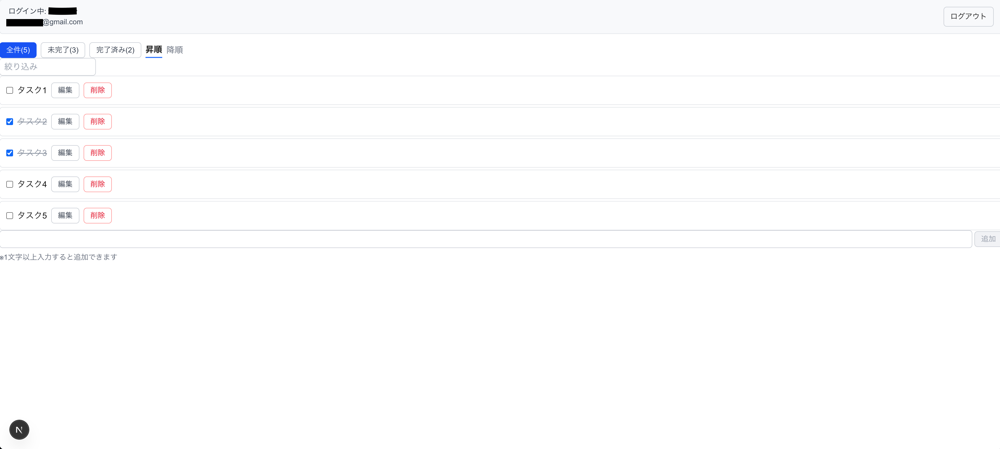
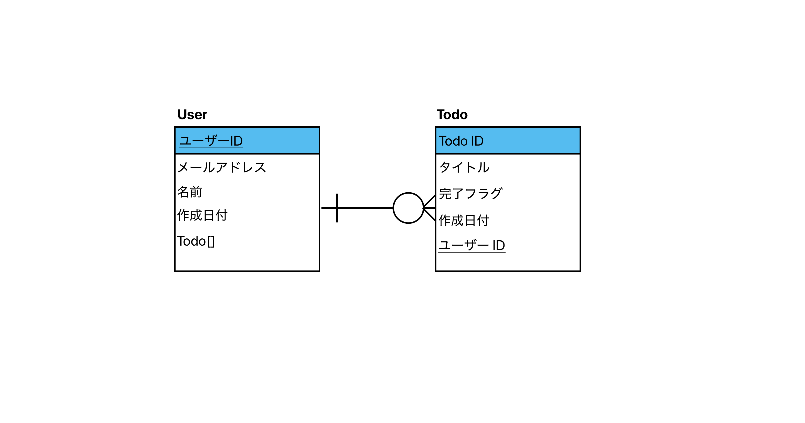
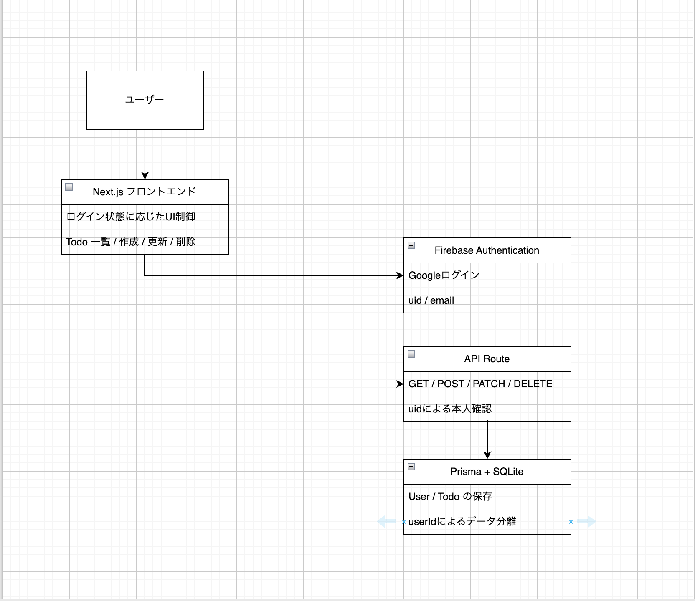

# Todo Auth DB

## 概要

Googleログインに対応した Todo アプリです。  
Firebase Authentication を利用して認証を実装し、ユーザーごとに Todo を分離して管理できるようにしました。

単純な CRUD アプリにとどまらず、以下を意識して実装しています。

- 認証状態と UI の連動
- ユーザー単位でのデータ分離
- Prisma を用いた User / Todo のリレーション設計
- DELETE / PATCH を含む本人確認ロジック
- エラーの責務分離（認証 / 入力 / Todo操作）

初学者として基礎実装だけで終わらせず、実務に近い設計を意識して作成したポートフォリオ用アプリです。

## 使用技術

- Next.js
- TypeScript
- Prisma
- SQLite
- Firebase Authentication
- Tailwind CSS

## スクリーンショット

### 未ログイン画面


### ログイン後画面



## ER図

User と Todo は 1対多 の関係で設計しています。  
Todo は `userId` を持ち、どのユーザーのデータかを DB レベルで管理しています。



## 構成図

Firebase Authentication で取得した `uid` をもとに、Next.js の API Route と Prisma を通して、Todo をユーザー単位で管理しています。



## 主な機能

- Googleログイン / ログアウト
- Todo の作成 / 一覧取得 / 更新 / 削除
- ユーザーごとの Todo 分離
- 完了 / 未完了フィルタ
- タイトル検索
- 並び替え
- 入力バリデーション
- エラーメッセージ表示

## 工夫した点

### 1. Firebase Auth を使ったユーザー単位の Todo 管理

Firebase Authentication の `uid` を利用して、ユーザーごとに Todo を分離しました。  
ログイン中ユーザーの `uid` をもとに GET / POST / PATCH / DELETE で処理を分岐し、自分の Todo だけを操作できるようにしています。

### 2. Prisma による User / Todo のリレーション設計

`User` と `Todo` を 1対多 の関係で設計し、`Todo.userId` で所有者を管理しています。  
これにより、単なるフロント上の表示切り替えではなく、DBレベルで「誰の Todo か」を持つ構造にしました。

### 3. DELETE / PATCH に認可の考え方を導入

作成・取得だけでなく、更新・削除でも `id` と `userId` をもとに本人の Todo か確認する処理を入れました。  
認証だけでなく、「そのユーザーが操作してよいか」という認可の観点も意識して実装しました。

### 4. API 呼び出しと UI ロジックの分離

API 通信は `todoApi.ts` にまとめ、`page.tsx` は状態管理と UI 制御に集中できるようにしました。  
これにより、責務を分けてコードを整理しました。

### 5. エラーハンドリングの責務分離

エラーを 1 つの state にまとめず、以下のように分離しました。

- `authError`：ログイン / ログアウト失敗
- `validationError`：入力バリデーション
- `todoError`：Todo の取得 / 作成 / 更新 / 削除失敗

表示場所も分けることで、どの種類の失敗なのか分かりやすくしています。

## 学んだこと

このアプリの実装を通して、主に以下を学びました。

- 認証と認可は別で考える必要があること
- Firebase のユーザー情報と DB のユーザー情報をどう結びつけるか
- GET は query parameter、POST は request body で値を受け取ること
- Prisma のリレーション設計と外部キーの考え方
- エラーハンドリングを責務ごとに分ける重要性
- state は最小限にし、表示は派生データで構築する設計の考え方

## 今後の改善点

- Firebase IDトークンを用いた本格的な認証検証  
  現在は学習目的のため、フロントから `uid` を渡す構成にしています。
- テストコードの追加
- UI / UX の改善
- デプロイ後の公開 URL の整備

## ローカル起動方法

1. リポジトリをクローン
2. 依存関係をインストール
3. Firebaseの設定値を`.env.local` に設定
4. Prisma のマイグレーションを実行
5. 開発サーバーを起動

```bash
npm install
npx prisma migrate dev
npm run dev

```

## 補足

このアプリは、基礎的なCRUD実装だけでなく、認証・認可・データ分離・責務分離までを一通り学ぶことを目的に作成しました。
次のアプリでは、より複数のモデルや業務フローを含む、より複雑なドメインの実装に進む予定です。
